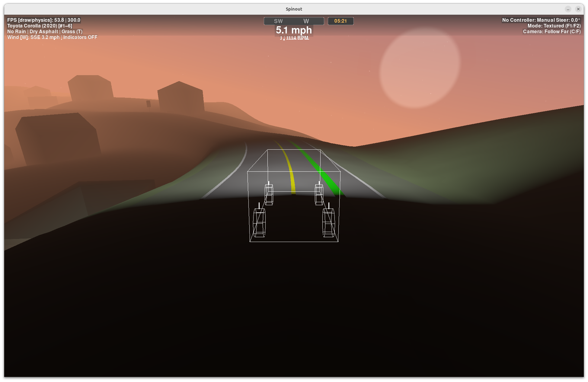
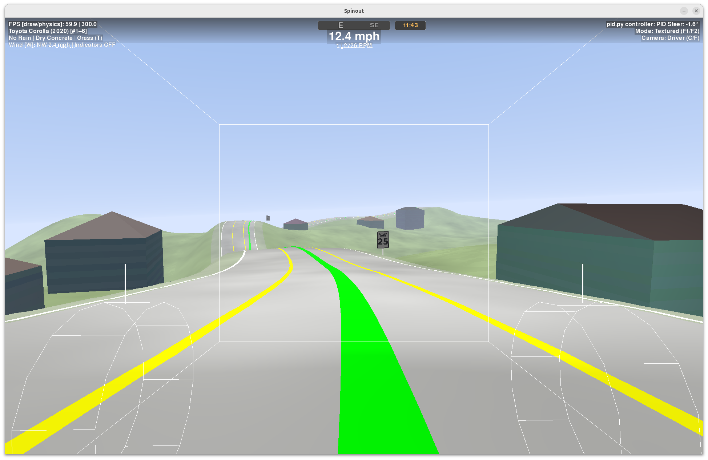
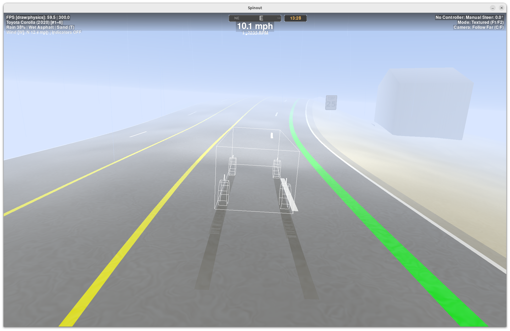
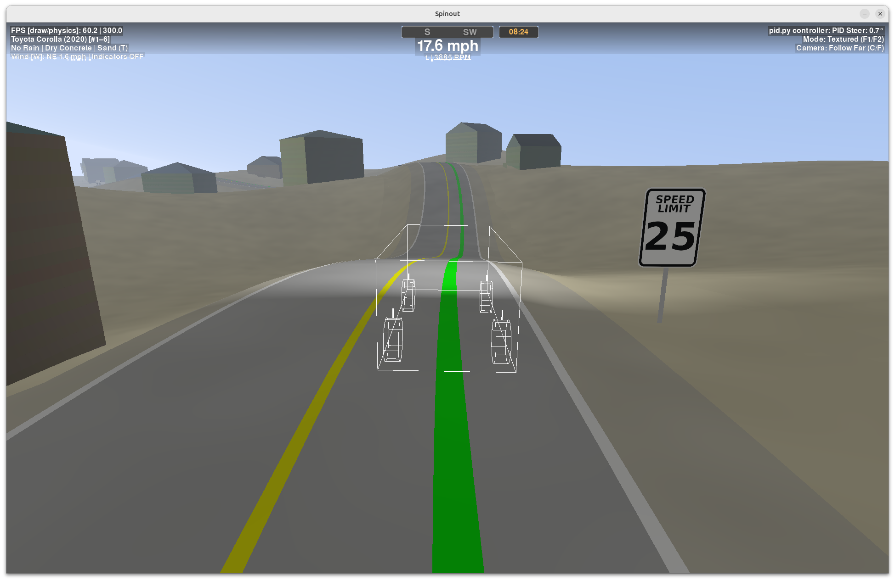

# Spinout

### Lightweight car dynamics sim for AI control on challenging terrain.

---

## Overview

**Spinout** is a fast, minimal, OpenGL-accelerated driving simulator built to test and train **AI controllers** (PID, RL, or custom models) in **accurate vehicle dynamics** over **randomly generated terrain and roads**.  

Forget the bloated dependencies and high-fidelity rendering of other simulators—Spinout is all about **speed, physics accuracy, and control evaluation**.

[Watch Video Demo](https://github.com/user-attachments/assets/329bb3c3-9c3f-4c3b-9294-0d1080335e63)






**Early-stage, but already usable for controller experiments and sim development.**

---
## What It Does

- **Drivable 3D sim, built for control work**  
  Fast vehicle dynamics, procedural terrain, generated roads, and lightweight OpenGL rendering.

- **Planner-aware controller interface**  
  Controllers receive vehicle state plus path targets and fixed-rate preview data for steering and speed logic.

- **Built-in baseline controller**  
  Includes a PID steering controller with curvature and road-roll feedforward.

- **Interactive and headless workflows**  
  Run it as a visual demo, or use the Gym-style environment API for testing and training loops.

- **Scenario variation out of the box**  
  Different road surfaces, terrain types, weather modifiers, wind, buildings, and speed-limit signage.

## Quick Start

```bash
git clone https://github.com/jonoomph/spinout.git
cd spinout
pip install -r requirements.txt
python -m src.game
```

Press `S` in the demo to toggle the built-in auto-steer controller.

## For Developers

Use the environment directly if you want to plug in your own controller or training loop. The simulator exposes normalized driver commands plus structured telemetry, planner targets, and preview horizons.

```bash
pytest -q
```

## Why Spinout

Spinout is aimed at the gap between toy 2D controller demos and heavyweight driving stacks: fast to iterate on, grounded in real control problems, and simple enough to modify.
