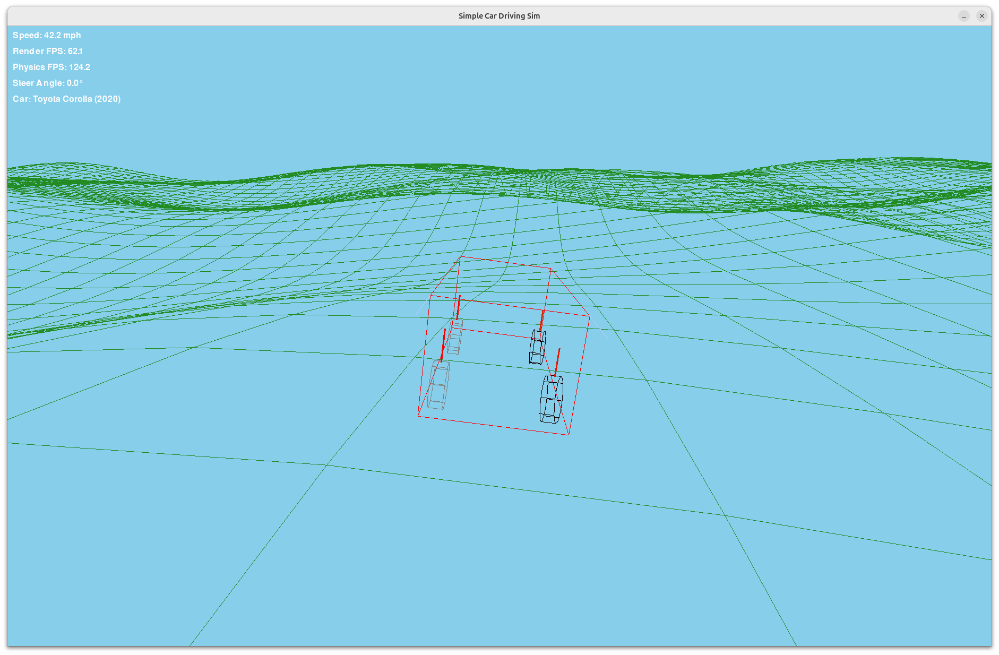

# Spinout

### Lightweight car dynamics sim for AI control on challenging terrain.

---

## Overview

**Spinout** is a fast, minimal, OpenGL-accelerated driving simulator built to test and train **AI controllers** (PID, RL, or custom models) in **accurate vehicle dynamics** over **randomly generated terrain and roads**.  

Forget the bloated dependencies and high-fidelity rendering of other simulators—Spinout is all about **speed, physics accuracy, and control evaluation**.


**NOTE: This repo is a **work-in-progress**, and still has lots of work before it is useful.**

---
## Features

- **Accurate Car Physics**  
  Simulates lateral & longitudinal forces (steer torque, accel, brake).
  
- **Random Terrain**  
  Generates procedurally created hills and slopes for varied scenarios.

- **OpenGL Accelerated**  
  Low-poly rendering for fast visualization without sacrificing simulation speed.
  
- **Minimal Dependencies**  
  Lightweight, clean Python package that's easy to install and run.

## Coming Soon...

- **Roads**  
  Generates procedurally created roads & hazards for varied scenarios.
  
- **Built-in Planner & Scoring**  
  Provides a baseline "brute-force" planner and scoring system for benchmarking.
  
- **Controller Plug-in**  
  Easily test your own Python controllers: PID loops, ML models, or heuristic drivers.

---

## Quick Start

### Install
```bash
git clone https://github.com/jonoomph/spinout.git
cd spinout
pip install -r requirements.txt
```

### Run
```bash
python game.py
```

## Inspiration

This project is inspired by the Comma.ai [controls challenge](https://github.com/jonoomph/controls_challenge), 
where I submitted an award-winning entry, using a neural network trained by a simple 2D driving game. This project
is an extension of that work, and will focus on 3D simulation of car dynamics on random terrain. The goal is to 
provide a fast, simple, and powerful training simulator for self-driving controllers, which focuses on both lateral and 
longitudal controls.

## About Me
I love working on AI, simulators, games, self-driving, and related tech, and I’m always interested in great conversations 
around these topics. If this project sparks ideas, or you’d like to discuss related work, feel free to reach 
out at jonathan@openshot.org.